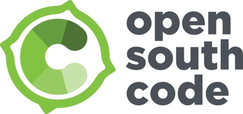
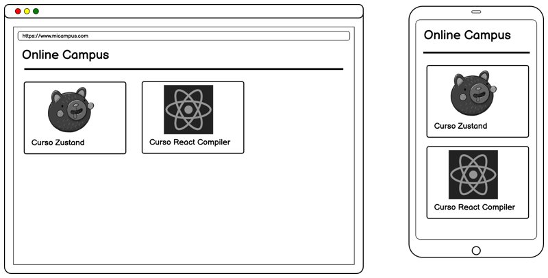
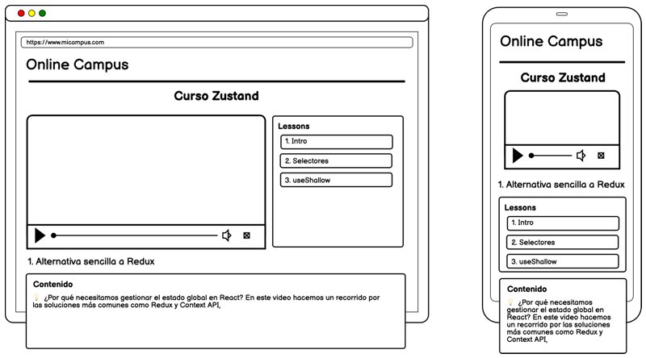

# Demos de la charla de introducción a Astro para Open South Code 2025

## Intro

En este repositorio encontrarás el código fuente y los ejemplos utilizados en la charla de introducción a Astro presentada en Open South Code 2025.

Cómo es una charla corta (30 minutos), hemos condensado las demos, en las próximas semanas publicaremos un tutorías paso a paso empezando desde cero, lo podrás encontrar en nuestro cana del youtube

https://www.youtube.com/lemoncoders

## El proyecto de ejemplo

En este ejemplo vamos a crear un sitio web estático con Astro que muestra una campus con una lista de cursos y su página de curso en la que podemos ver una serie de lecciones con sus video y el contenido del mismo en markdown,

Los mocks de baja fidelidad de la interfaz:

> Estos mocks los hemos realizado utilizando [Quickmock](https://www.quickmock.net/), una herramienta de prototipado rápido, open source y gratuita, que nos permite crear interfaces de usuario de forma sencilla y rápida.

Se parte de una semilla (00-punto-partida) en la que ya tenemos configurado:

- Astro.
- Tailwind.
- Setup de [Content Island](https://contentisland.net/), un Headless CMS para Astro.
- Acceso a endpoints de Content Island para obtener los cursos y lecciones.

Se desarrolla un ejemplo, que se puede encontrar completo, así como con una guía paso a paso (Readme.md dentro de esas carpeta) en _01-completo_, que desarrolla:

- Pagina de listado de cursos.
- Pagina de detalle de curso y lecciones con rutas dinámicas.
- Navegación SPA.

Como bonus en _02-bonus-react_ puedes ver como integrar un componente de React en Astro.
